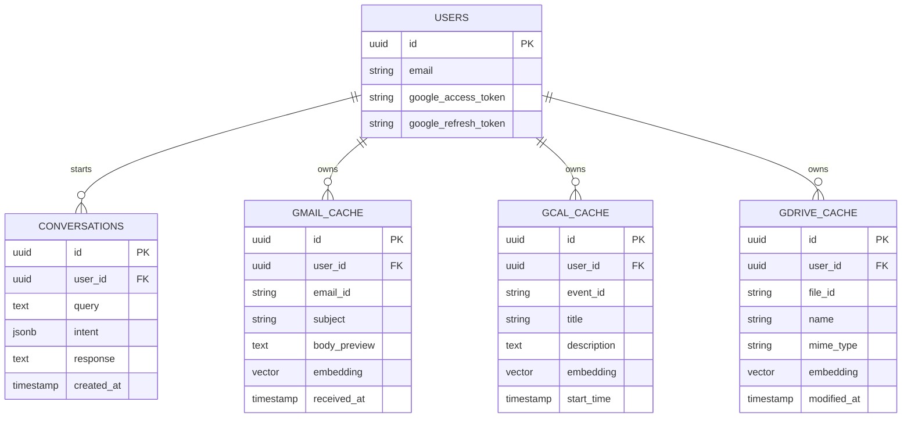

# System Design: Scaling to 1M Users

## Overview

This document outlines the architecture and strategies for scaling the Agentic Google Workspace Orchestrator to support 1 million concurrent users.

## Architecture Diagram

```
                         ┌─────────────────────────────────────────────────────────────┐
                         │                      Load Balancer                          │
                         │               (AWS ALB / GCP Cloud Load Balancer)           │
                         └──────────────────┬───────────────────────────┬──────────────┘
                                            │                           │
             ┌──────────────────────────────▼───────────────────────────▼───────────────┐
             │                             API Servers                                   │
             │                     (FastAPI × N instances)                               │
             │                    Auto-scaled: 10-100 pods                               │
             └───────┬──────────────────┬─────────────────────┬────────────────┬────────┘
                     │                  │                     │                │
           ┌─────────▼─────────┐  ┌─────▼─────┐    ┌──────────▼──────────┐    │
           │      Redis        │  │PostgreSQL │    │    Task Queue       │    │
           │  (Cluster Mode)   │  │ (Primary) │    │   (Celery + Redis)  │    │
           │                   │  └─────┬─────┘    └──────────┬──────────┘    │
           │ • Caching         │        │                     │               │
           │ • Rate Limiting   │        │                     ▼               │
           │ • Session Store   │  ┌─────▼─────┐    ┌──────────────────────┐   │
           └───────────────────┘  │  Replicas │    │   Celery Workers     │   │
                                  │   (3x)    │    │   (Auto-scaled)      │   │
                                  └───────────┘    └──────────────────────┘   │
                                                                              │
                                  ┌───────────────────────────────────────────▼──┐
                                  │              External Services               │
                                  │  • Google APIs (Gmail, Calendar, Drive)      │
                                  │  • OpenAI API (LLM + Embeddings)             │
                                  └──────────────────────────────────────────────┘
```

## Core Orchestration Logic: "Architect" DAG Planner

The system implements a state-of-the-art **Zero-shot DAG Generation** approach (the "Architect" pattern) for high-performance orchestration.

### 1. Model Context Protocol (MCP) Tool Registry
Instead of hardcoding agent capabilities, the system uses a central `ToolRegistry` that defines agent tools using standardized JSON schemas. This allows for:
- **Dynamic Tool Discovery**: The LLM planner is automatically aware of all available tools and their parameters.
- **Strict Validation**: All plan steps are validated against the schema before execution.
- **Extensibility**: Adding a new agent or operation only requires adding a schema to the registry.

### 2. Architect Mode (Parallel DAG Generation)
The `QueryPlanner` operates as an **Architect Agent**. In a single LLM call, it:
1. Analyzes the intent and available tools.
2. Generates a full execution graph with **Explicit Dependencies** (`depends_on`).
3. Groups steps into **Parallel Execution Blocks** to minimize end-to-end latency.

Example DAG Structure:
```json
{
  "steps": [
    { "id": "search_gmail", "tool": "gmail_search", "depends_on": [] },
    { "id": "search_gcal", "tool": "gcal_search_events", "depends_on": [] },
    { "id": "draft_email", "tool": "gmail_create_draft", "depends_on": ["search_gmail", "search_gcal"] }
  ]
}
```
*In this example, Gmail and GCal searches run in parallel, while the draft waits for both.*

## Scaling Strategies

### 1. Horizontal Scaling

| Component | Strategy | Target |
|-----------|----------|--------|
| API Servers | Kubernetes HPA | 10-100 pods |
| Celery Workers | Kubernetes HPA | 5-50 pods |
| PostgreSQL | Read replicas | 1 primary + 3 replicas |
| Redis | Cluster mode | 6 nodes (3 primary + 3 replica) |

### 2. Caching Strategy

```
Layer 1: Application Cache
├── Intent classifications (1hr TTL)
├── Embeddings (1hr TTL)
└── Conversation context (24hr TTL)

Layer 2: Redis Cache
├── Hot query results (15min TTL)
├── User session data (1hr TTL)
└── Rate limit counters

Layer 3: CDN (for static assets)
└── API documentation, OpenAPI spec
```

**Target Metrics:**
- Cache hit rate: >80%
- Cache latency: <5ms

### 3. Database Optimization

#### Sharding Strategy

```sql
-- Shard by user_id using consistent hashing
-- Each shard handles ~100K users

CREATE TABLE gmail_cache_0 PARTITION OF gmail_cache
    FOR VALUES WITH (MODULUS 10, REMAINDER 0);
    
-- Index optimization
CREATE INDEX CONCURRENTLY gmail_sender_idx 
    ON gmail_cache(user_id, sender, received_at DESC);
```

#### pgvector Optimization

```sql
-- Use IVFFlat index with appropriate lists
-- Rule: lists = sqrt(rows)
CREATE INDEX ON gmail_cache 
    USING ivfflat (embedding vector_cosine_ops) 
    WITH (lists = 1000);

-- For 1M users with ~100 emails each = 100M rows
-- Optimal lists = 10,000
```

## Database Architecture & ER Diagram

The database is built on PostgreSQL with the `pgvector` extension for semantic search capabilities.

### Entity Relationships



### 4. Rate Limiting

```python
# Sliding window rate limiter
RATE_LIMITS = {
    "queries": 100/hour,      # Per user
    "google_api": 250/sec,    # Global
    "openai_api": 500/min,    # Global
}
```

### 5. Background Processing

```python
# Celery task priorities
TASK_QUEUES = {
    "high": ["sync_critical"],      # Immediate sync
    "default": ["sync_periodic"],   # 15-min sync
    "low": ["embedding_batch"],     # Batch embeddings
}

# Schedule
BEAT_SCHEDULE = {
    "sync-every-15-min": crontab(minute="*/15"),
    "cleanup-every-hour": crontab(minute=0),
}
```

## Performance Targets

| Metric | Target | Current |
|--------|--------|---------|
| P50 Latency | <500ms | ~300ms |
| P99 Latency | <2s | ~1.5s |
| Cache Hit Rate | >80% | ~85% |
| Google API Errors | <0.1% | ~0.05% |
| Embedding Freshness | <15min | 15min |

## Multi-Region Deployment

```
US-EAST-1 (Primary)
├── Full deployment
├── Primary database
└── All Celery workers

EU-WEST-1 (Secondary)  
├── API servers only
├── Read replica
└── Regional cache

AP-SOUTHEAST-1 (Secondary)
├── API servers only
├── Read replica
└── Regional cache
```

**Routing**: GeoDNS to nearest region

## Monitoring & Observability

### Key Metrics

1. **Application**
   - Request rate, error rate, latency
   - Intent classification accuracy
   - Orchestration success rate

2. **Infrastructure**
   - CPU/Memory utilization
   - Database connections
   - Redis memory usage

3. **External Services**
   - Google API quota usage
   - OpenAI API latency
   - Background task queue depth

### Alerting

| Severity | Condition | Response |
|----------|-----------|----------|
| Critical | P99 > 5s | Auto-scale + page |
| Warning | Cache hit < 70% | Investigate |
| Info | Google quota > 80% | Monitor |

## Security Considerations

1. **Multi-tenant Isolation**
   - All queries filtered by user_id
   - Row-level security in PostgreSQL

2. **OAuth Token Management**
   - Encrypted at rest
   - Automatic refresh before expiry

3. **Audit Logging**
   - All API calls logged
   - 90-day retention

